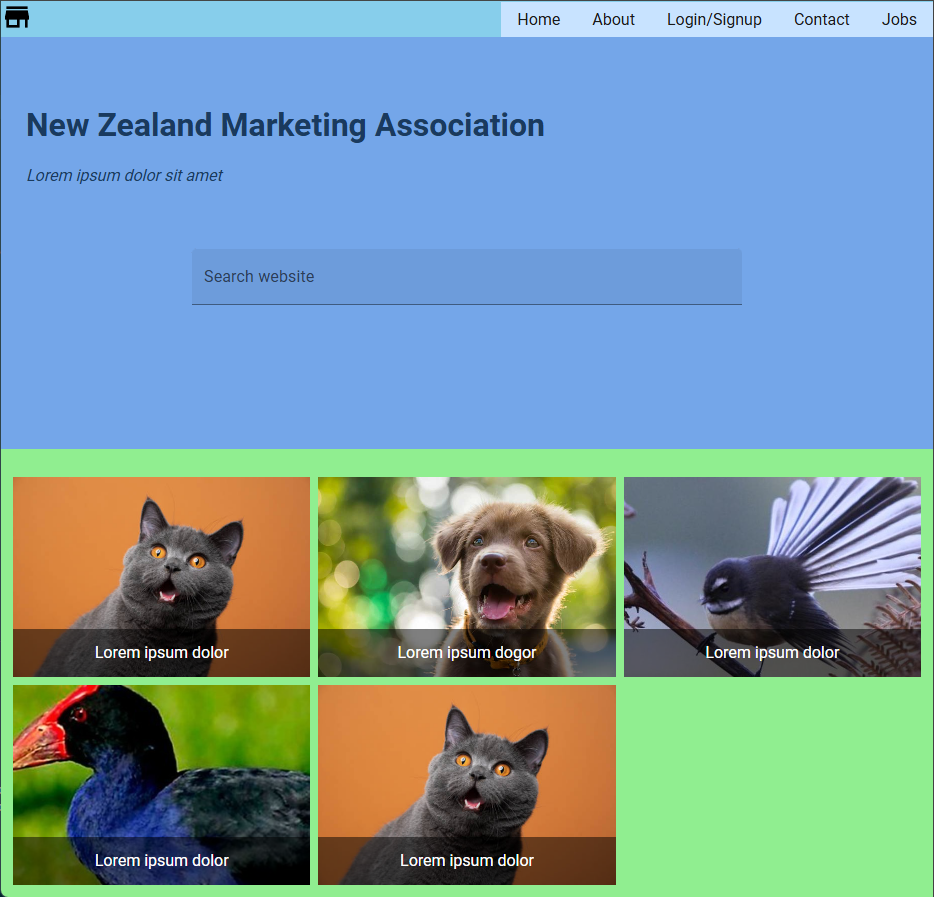
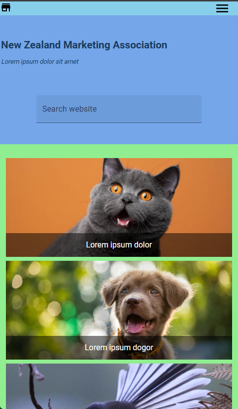
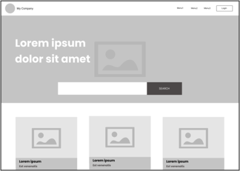
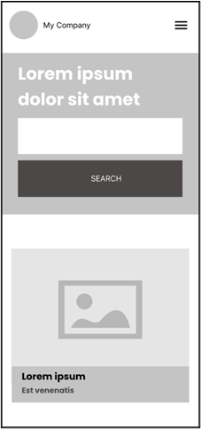
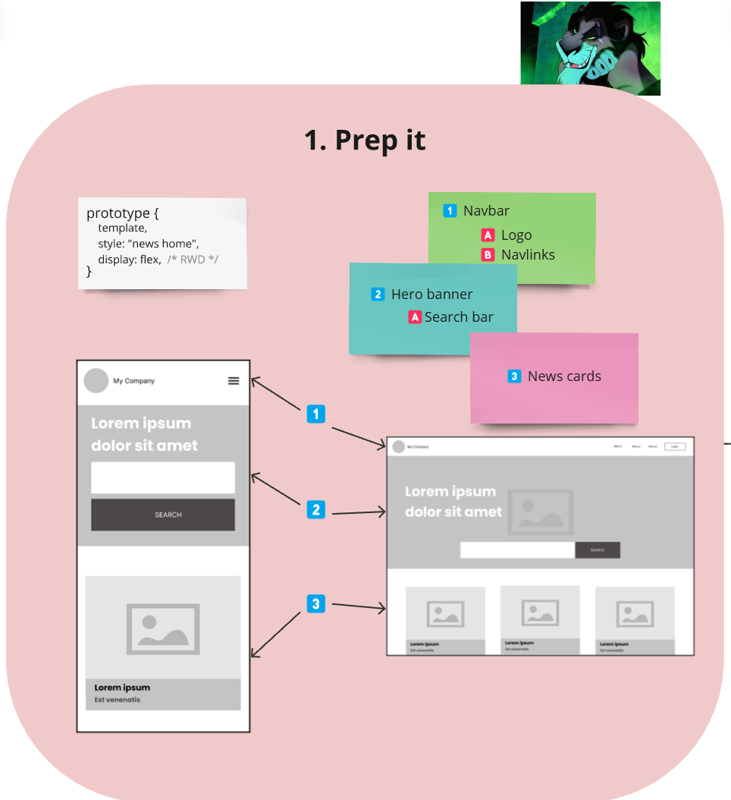
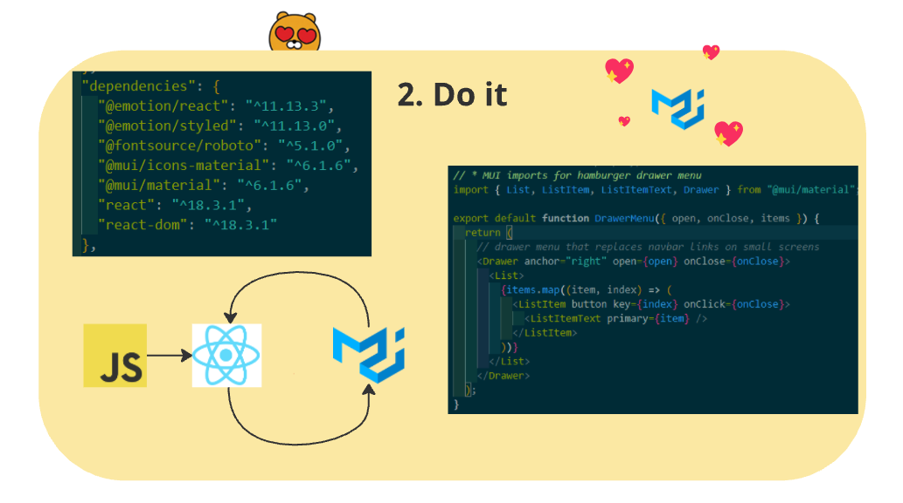
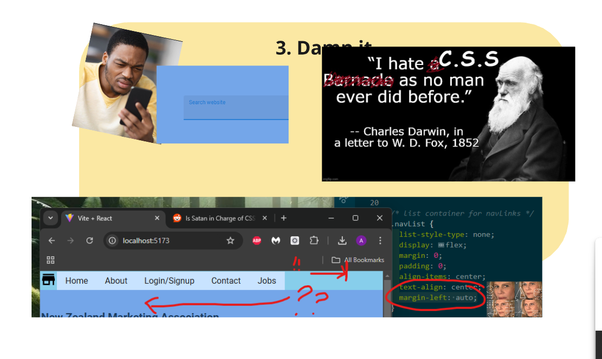
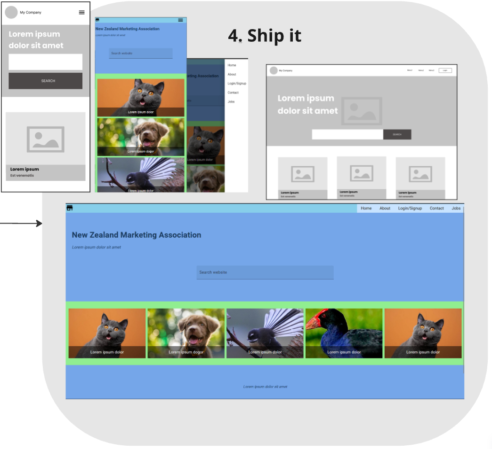

<a id="readme-top"></a>

[![MIT License][license-shield]][license-url]

<br />
<div align="center">
  <h3 align="center">ADV Mission 0 - Marketing Association New Zealand</h3>
</div>

<details>
  <summary>Table of Contents</summary>
  <ol>
    <li>
      <a href="#about-the-project">About The Project</a>
      <ul>
        <li><a href="#the-brief">Built With</a></li>
        <li><a href="#built-with">Built With</a></li>
      </ul>
    </li>
    <li><a href="#prerequisites">Prerequisites</a></li>
    <li>
  <a href="#execution">Execution</a>
  <ul>
    <li><a href="#considerations">Considerations</a></li>
    <li><a href="#implementation">Implementation</a></li>
    <li><a href="#challenges">Challenges</a></li>
  </ul>
</li>
    <li><a href="#presentation">Presentation</a></li>
    </li>
    <li><a href="#usage">Usage</a></li>
    <li><a href="#license">License</a></li>
  </ol>
</details>

<!-- ABOUT THE PROJECT -->

## About The Project




This prototype aims to fullfil the brief for Mission 0, with considerations made for its end use as a template and a lot of attention paid to surrounding documentation and presentation.

### The Brief

> You are contracted by Marketing Association New Zealand to build a quick page as a template for their new digital news home page.

> You will need to create one page with a mobile responsive layout that resembles the wireframe as shown:




<p align="right">(<a href="#readme-top">back to top</a>)</p>

### Built With

- [![React][React.js]][React-url]
- [![Material UI][Material-UI]][MUI-url]

<p align="right">(<a href="#readme-top">back to top</a>)</p>

<!-- GETTING STARTED -->

## Prerequisites

- npm

  ```sh
  npm install
  ```

- mui
  ```sh
  npm install @mui/material @emotion/react @emotion/styled
  ```

<p align="right">(<a href="#readme-top">back to top</a>)</p>

## Execution

### Considerations

The brief is succint so I made a few assumptions. The wireframes were a good start, and the basic elements were obvious: a navbar, a hero banner containing a search box, and some kind of image gallery or media card list. Responsive design would be implemented for mobile devices by making some layout adjustments, notably to the navbar and the cards.

Key assumptions:

- 'template': so it should be easy to duplicate or modify
- 'news home page': so the images in the wireframe may be intended as media previews with captions or synopses

### Implementation

The colour theme is less a suggestion and more a way to make each part of the page easy to distinguish for ease of future styling. Hero banners are probably best served by on-brand background images or corporate wallpapers.

While we only needed one page, I took advantage of React's modularity to divide that one page into smaller, generally dynamic components. This makes those components reusable, scalable, and easier to maintain, all qualities that could be valuable in a template.

### Challenges

I took this as a chance to try using Material UI elements, something I've never done. I had intended to use MUI for all the elements in the page for a more cohesive design both in the render and the code.

Due to my inexperience, the sheer depth of options available for MUI elements, and just my own learning speed, I had to choose to scale back my use of MUI elements to some but not all parts of the code. Some core elements (ex. the media cards' <ImageList/>) use MUI, but the rest of the code falls back onto CSS modules. This undermines the maintainability of the code due to inconsistency and the added styling complexity.

<p align="right">(<a href="#readme-top">back to top</a>)</p>

## Presentation

Below are the frames used for the Mission Show & Tell






## License

Distributed under the MIT License. See `LICENSE.txt` for more information.

<p align="right">(<a href="#readme-top">back to top</a>)</p>

<!-- MARKDOWN LINKS & IMAGES -->
<!-- https://www.markdownguide.org/basic-syntax/#reference-style-links -->

[license-shield]: https://img.shields.io/github/license/othneildrew/Best-README-Template.svg?style=for-the-badge
[license-url]: https://github.com/othneildrew/Best-README-Template/blob/master/LICENSE.txt
[React.js]: https://img.shields.io/badge/React-20232A?style=for-the-badge&logo=react&logoColor=61DAFB
[React-url]: https://reactjs.org/
[Material-UI]: https://img.shields.io/badge/Material%20UI-007FFF?style=for-the-badge&logo=mui&logoColor=white
[MUI-url]: https://mui.com/
